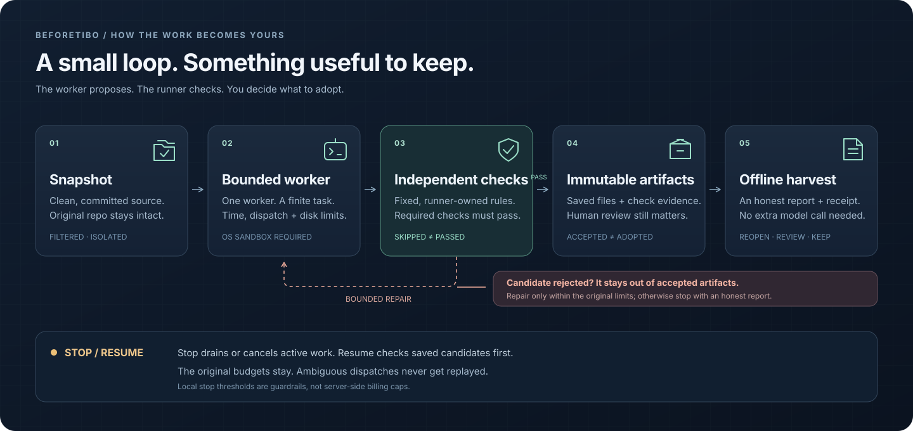
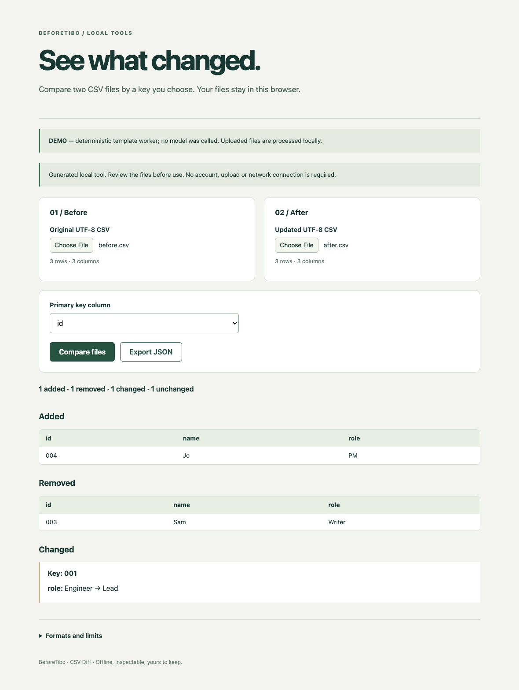
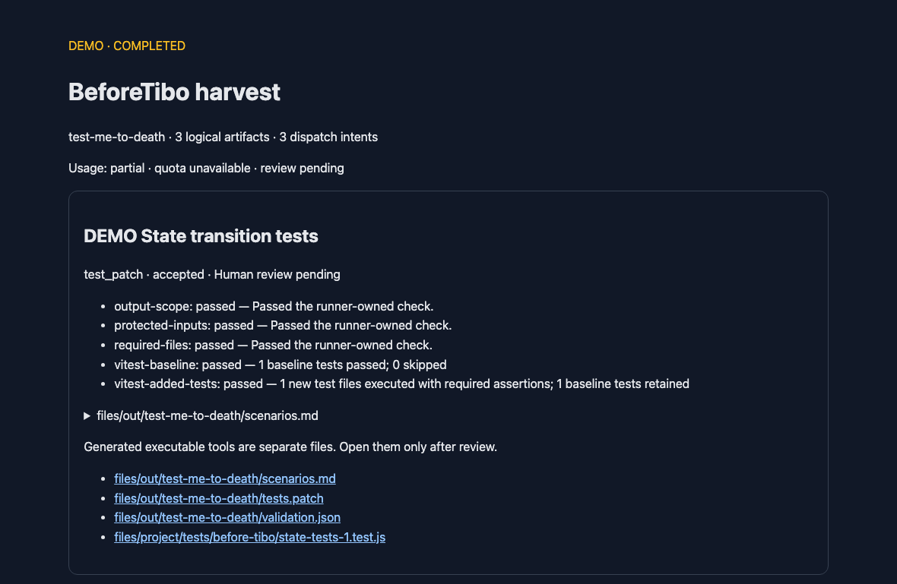

<div align="center">


# BeforeTibo

**额度用过，成果留下。**

给那些「有空再写」的文档、测试和小工具，一个有边界的开工机会。

[English](README.md) · **简体中文** · [快速开始](#五分钟看见成果) · [安全边界](docs/security-model.md) · [验收记录](https://github.com/tty627/BeforeTibo/blob/master/docs/acceptance-results.md)

`v0.1.0-alpha.1` · `Node.js 24` · `本地 CLI` · `MIT`

</div>

## 这是什么？

你的 Codex 还有额度，你的 TODO 也还有很多。

BeforeTibo 是一个本地任务运行器：选一个 Recipe（内置任务配方），给它范围和预算，它就在隔离环境里生成候选成果，交给独立检查器验收，再把通过的文件和收获报告保存在本地。文档、测试补丁、离线小工具，都有具体的落点。

**可以中途叫停，可以恢复；已经收下的成果，不用再问一次模型才能拿出来。**

> **Alpha 状态：** mock 闭环、协议测试、真实隔离测试和 CSV 浏览器验收已运行。真实 Codex 模型任务、账户与额度联调仍是 **NOT RUN**。下面的截图来自明确标记的合成 **DEMO**；生成是模拟的，文件保存和验收是真的。[查看实际证据](https://github.com/tty627/BeforeTibo/blob/master/docs/implementation-status.md)。

## 名字里的梗

社区里有人等额度重置，发帖问：[「Tibo, when reset?」](https://www.reddit.com/r/codex/comments/1venbdj/tibo_when_reset/)。

BeforeTibo 接的是这个梗：**在下一次 “when reset?” 之前，先把一直欠着的活变成能留下的东西。**

README 可以玩梗，计数器不能。这里不预测重置、不兑换 reset、不购买额度，也不承诺“免费跑”。你愿意使用多少，由你决定；程序负责记账、检查和按边界停下来。

这是独立社区项目，与 OpenAI 或任何个人均无官方隶属或背书关系。

## 三道配方，三种收获

| Recipe | 适合哪笔技术债 | 最后留下什么 | 怎么验 |
|---|---|---|---|
| **Repo Book** | 「这个仓库只有上个月的我看得懂」 | 带源码引用的仓库说明 | 核对快照、文件哈希、路径与行号；独立验收不运行仓库脚本 |
| **Test Me to Death** | 「这段代码应该没问题吧」 | 新测试、可审阅的 patch、复现记录 | 先跑原基线，再在隔离副本里实际执行新增断言 |
| **Toolsmith CSV** | 「再用眼睛对一次 Excel 就辞职」 | 完整的离线 CSV Diff 小工具 | 浏览器实际上传、按主键比较、下载 JSON，与固定预期逐项核对 |

验收不是神谕：引用正确，不代表所有解释正确；测试通过，也不代表没有 bug。报告会列出检查范围、失败、未完成和待人工审阅项。

## 它怎么把东西留下来？



原仓库保持原样。worker 负责提出候选，runner 负责验收和保存；worker 不能给自己盖章，也不能改预算、检查器或已经接受的成果。未通过的候选会被明确记录，修复次数耗尽后就停，不进入「再试最后一次」的永动机。

### 真正能打开的 CSV 工具



*DEMO 合成样例，实际浏览器截图。上传两份 CSV，选择主键，查看四类差异并导出 JSON；支持 BOM、带引号的逗号和换行，保留 `001` 这样的字符串。单文件上限 5 MiB、20,000 行。*

### 跑完以后，账和成果放在一起



*DEMO 合成测试仓库，实际报告截图。每个成果能追溯到它经历的检查；未知的 token 或额度保持未知，不补一个看起来舒服的 0。*

## 五分钟看见成果

需要 **Node.js 24.x** 和 Git。先从源码安装；本项目**尚未发布 npm 包**。

```sh
git clone https://github.com/tty627/BeforeTibo.git
cd BeforeTibo
npm ci
npm run build
node dist/cli.js demo
```

最后一条命令会生成 Repo Book DEMO，并输出 `harvest/index.html` 的位置。用浏览器打开，就能看到真正保存下来的文件和报告。这个 DEMO **不需要 Codex、不登录账户、不调用模型**；安装依赖后可以离线运行。

```sh
node dist/cli.js recipes list
node dist/cli.js doctor --json
```

`doctor` 检查本机能力，不执行模型任务，也不读取账户额度。先玩 DEMO，再看 [环境要求](docs/supported-environments.md) 和 [Codex 兼容性](docs/codex-compatibility.md)。

<details>
<summary><strong>再试另外两个 DEMO</strong></summary>

执行型验收当前只在文档列明的 macOS 环境实测。源码开发依赖已固定 Vitest 和 Playwright；CSV 还需显式准备浏览器：

```sh
npx --no-install playwright install chromium
node dist/cli.js demo --recipe test-me-to-death
node dist/cli.js demo --recipe toolsmith-csv
```

生成端仍是合成 DEMO，验收会真的在隔离环境中运行。CSV 得到完整工具后，如果后续两次没有实质进展，会停止扩展并保留已接受的工具。`STOPPED` 可以有收获，`COMPLETED` 也不等于所有自然语言内容都正确。

Linux 可以运行离线结构检查与 Repo Book DEMO；首版未实现 Linux 执行沙箱，执行型任务会明确 `BLOCKED`。缺少浏览器验收不能算功能通过。

</details>

## 用在自己的任务上

先做静态规划，不消耗模型额度：

```sh
node dist/cli.js plan /path/to/repo --recipe repo-book
```

确认输入、权限和费用风险后，再启动：

```sh
node dist/cli.js run /path/to/repo --recipe repo-book --preset gentle
node dist/cli.js run /path/to/repo --recipe test-me-to-death
node dist/cli.js run /path/to/output-parent --recipe toolsmith-csv
```

真实运行需要可核验的 ChatGPT-managed Codex 登录、受支持的沙箱与扩展隔离，以及本次执行和消费风险同意。非交互运行必须同时提供 `--ack-spend-risk --ack-execution-risk`；配置文件不等于同意。条件不满足会给出 `BLOCKED`。

Repo Book 和测试 Recipe 从**干净、已有提交的 Git 树**筛选输入。测试 Recipe 目前只支持已安装依赖的单包 npm 项目，要求已提交 lockfile、独立 Vitest 配置、Vitest 4.1.11 / Vite 7.x；不支持 monorepo，也不会自动安装项目依赖。

## 额度有边界，梗没有特权

| 预设 | 最多派发 | 总时限 | worker 数 |
|---|---:|---:|---:|
| `gentle` | 4 | 20 分钟 | 1 |
| `hard` | 12 | 60 分钟 | 1 |
| `tibo` | 24 | 120 分钟 | 1 |

默认 `gentle`：单任务最多 600 秒、最多两次修复、500 MiB 本地磁盘停止阈值（周期检查，不是文件系统硬配额）。预设只调整有界数值，**不会扩大权限**。首次尝试和修复都在启动前占用派发名额。

派发数、模型 token usage、账户额度是三种不同的账。**本地次数、时间和保留阈值不是服务端账单硬上限**；真实任务可能消耗已有 credits，账户变化也可能来自其他会话。quota 模式还必须核验身份、模型对应的额度桶与快照新鲜度；无法核验就停止，不猜数值。要求绝对零额外费用却缺少可验证的服务端保证时，会阻止真实运行。

### 随时喊停，之后再收拾

一次 `Ctrl+C` 停止新增任务并有界收尾；第二次立即取消本 run 拥有的进程组。

```sh
node dist/cli.js status run-ID --json
node dist/cli.js stop run-ID
node dist/cli.js stop run-ID --immediate
node dist/cli.js resume run-ID
node dist/cli.js harvest run-ID
node dist/cli.js open run-ID
node dist/cli.js export run-ID --output /path/to/new-directory
```

恢复沿用原来的预算和期限；执行情况不明的任务不会自动重发，已保存候选会优先本地验收。`harvest` 不需要新模型调用。使用自定义状态目录时，各命令需传同一个 `--state-dir`。

## 文件去了哪里？

默认在 `~/.before-tibo/runs/`。已接受成果按哈希保存，收获报告提供 HTML、Markdown 和 JSON。

未跟踪文件、已知凭证路径、检测到的疑似凭证内容及自动加载的控制面文件不进入输入快照；这不是对任意秘密的完备识别，仍应审查待提交内容。tracked dirty、符号链接和 submodule 会被阻止。项目不上传遥测、不自动发布用户成果。真实模型任务仍会向 Codex 服务发送获准的上下文，**“本地编排”不等于数据永不出设备**。

收获报告不执行生成脚本；生成工具需要单独审阅后打开。分享导出只含脱敏摘要，不带可能含私有源码的文档、patch、原始日志或精确额度历史。详见 [安全模型](docs/security-model.md)。

## 想读代码、提问题或一起做

| 想了解 | 从这里开始 |
|---|---|
| 怎么调度、保存和恢复 | [架构](docs/architecture.md) |
| 哪些平台确实测过 | [环境矩阵](docs/supported-environments.md) |
| 为什么被 BLOCKED | [故障排查](docs/troubleshooting.md) |
| 测过什么，什么没测 | [92 项验收记录](https://github.com/tty627/BeforeTibo/blob/master/docs/acceptance-results.md) · [实施日志](https://github.com/tty627/BeforeTibo/blob/master/docs/implementation-status.md) |
| 开发与发布 | [贡献指南](CONTRIBUTING.md) · [发布流程](docs/releasing.md) |

```sh
npm run lint
npm run typecheck
npm test
npm run test:contracts
npm run test:integration
npm run build
npm run demo:smoke
npm run test:pack
npm run scan:secrets
```

公共 CI 不需要个人凭证或模型调用。首版保持单 worker、三个内置 Recipe，不包含 SaaS、远程执行或自动合并发布。

**[MIT](LICENSE) © 2026 tty627。** 用户输入、生成 patch 和第三方代码保留各自的许可要求。
